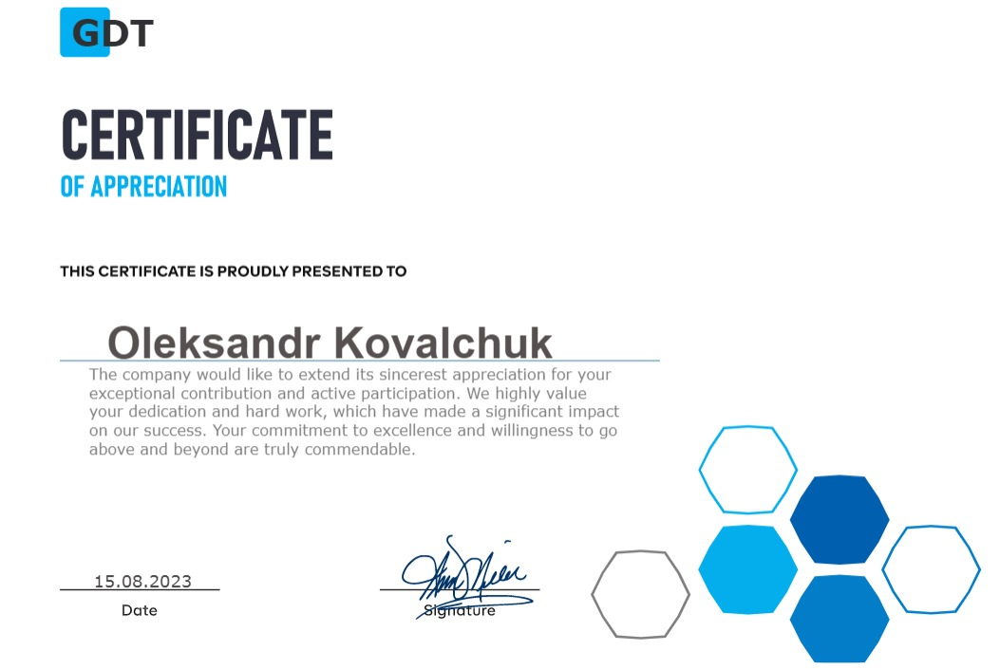

# Описание:
**Certificate Service**: Проект представляет собой веб-приложение для генерации сертификатов в формате PDF.

**tags:** `Node.js` `Express`  `Playwright`  `EJS` 

**features:** `PDF from HTML-template` `PDF generation from POST-data`  

--- 

### 🟣 POST `/generate-certificate`

Запрос на генерацию сертификата 

#### Пример запроса
`POST` `/generate-certificate`

`Content-Type: application/json`
```
{
  "company": "GDT",
  "text": "The company would like to extend its sincerest appreciation for your exceptional contribution and active participation. We highly value your dedication and hard work, which have made a significant impact on our success. Your commitment to excellence and willingness to go above and beyond are truly commendable.",
  "person": "Oleksandr Kovalchuk",
  "date": "15.08.2023"
}
```
#### Ответ 
`Content-Type', 'application/pdf`
`Content-Disposition', 'inline; filename="certificate.pdf"`
> 
